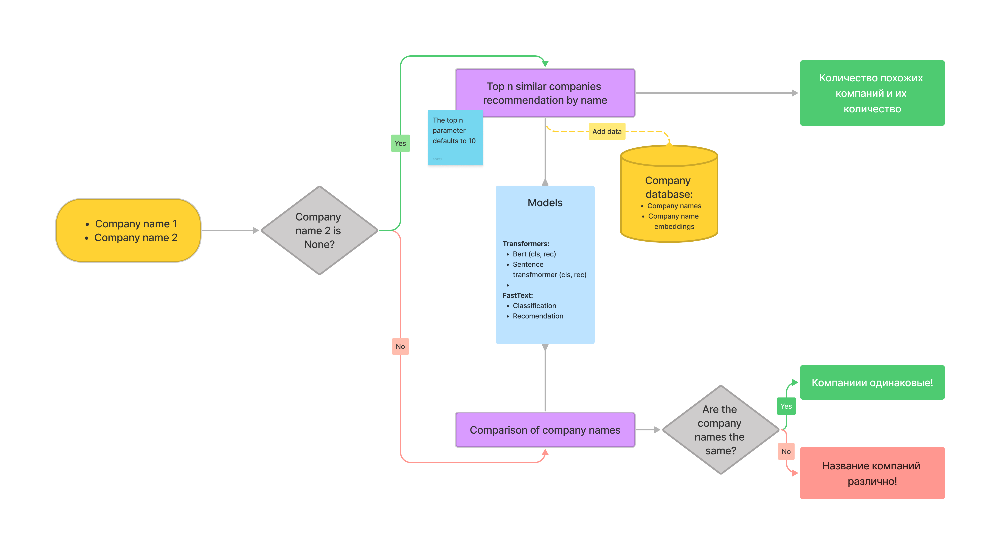

# Car number
**Detection of car numbers and their recognition**
# Project structure

# Pipeline 


Our solution consists of several main parts:
1. **Сlassifier** - solving a classification problem to determine whether the names are one firm
2. **Recommendation** - solving the recommendation problem in order to suggest top n similar company names for the name of one company

There is a strict interface for each of the parts. Each part is independent of the other. A special interface has been implemented for this module.

This rep presents three methods for solving the problem:
1. Using Bert
2. Using Sentence Transformers 
3. Using FastText

```
.
├── data
├── notebooks               <- Jupyter notebooks
├── README.md               <- The top-level README for developers using this project
├── requirements.txt        <- The requirements file for reproducing the analysis environment
├── weights                 <- Empty folder for saving results
├── src
│   ├── bert                <- Folder that contains bert solution
│   ├── fasttext            <- Folder that contains fasttext solution
│   ├── sentence_bert       <- Folder that contains tentence transformers solution
│   ├── utils
└── tutorial.ipynb          <- Demonstration work
```

# Results 
-
## Metrics
- 
## Performance 
-

# Usage
We tested three different models:
- bert
- sentence transformer
- FastText

You can combine them however you like. Be careful with experiments, look at the results.

To demonstrate the results of the project, you can use a [tutorial.ipynb](./tutorial.ipynb) Before using it, you need to install the project dependencies:
```
pip install -r requirements.txt 
```

After installing the dependencies, you need to be in the **root folder** of the repository run commands:
```
# Linux command
chmod +x load_data.sh
./load_data.sh
```

[**Link**](https://drive.google.com/drive/folders/175r-xavYr0N_iv7QhI7fAFiYw1e-qqAh?usp=sharing) to the directory with all weights that are used in this work.
# Reference 
1. [Bert](https://huggingface.co/docs/transformers/model_doc/bert)
2. [SentenceTransformers](https://www.sbert.net/)
3. [fastText](https://github.com/facebookresearch/fastText)
4. [Contrastive Loss](https://www.sbert.net/docs/package_reference/losses.html)
5. [Contrastive Loss Explaines](https://towardsdatascience.com/contrastive-loss-explaned-159f2d4a87ec)
6. [Dimensionality Reduction by Learning an Invariant Mapping](http://yann.lecun.com/exdb/publis/pdf/hadsell-chopra-lecun-06.pdf)
7. [Label Smoothing Cross Entropy](https://towardsdatascience.com/what-is-label-smoothing-108debd7ef06)
